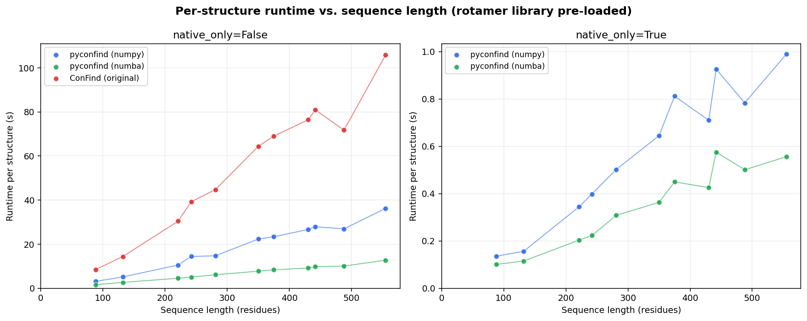

# pyconfind

[](https://github.com/timodonnell/pyconfind/actions/workflows/ci.yml)
[](https://pypi.org/project/pyconfind/)
[](https://www.python.org/)
[](LICENSE)
[](https://colab.research.google.com/github/timodonnell/pyconfind/blob/main/examples/pyconfind_demo.ipynb)

A modern Python implementation of [ConFind](https://grigoryanlab.org/confind/) —
the rotamer-based protein side-chain contact-degree analysis introduced in
[Zheng et al 2015](https://www.cell.com/structure/fulltext/S0969-2126(15)00119-7)
and [Zheng et al 2017](https://journals.plos.org/plosone/article?id=10.1371/journal.pone.0178272).

The Python output is **byte-for-byte identical** to the upstream C++ binary
on **248 of 253** real structures tested (100 single-chain PDB + 100 AlphaFold
DB + 50 multi-chain + 3 high-resolution; see
[docs/stress_test_results.md](docs/stress_test_results.md)), plus a further 100
RCSB entries cross-checked as both PDB and mmCIF. The 5 exceptions are
insertion-code structures where the C++ ordering relies on undefined behavior
(documented). The test suite runs against real PDB/mmCIF structures with
committed C++-reference contact maps.

pyconfind is also faster than the C++ binary, with two interchangeable
contact-degree backends (both byte-identical to the reference):

* a pure NumPy/SciPy reference, which on its own already beats the C++ binary;
* an optional **Numba** JIT/multi-threaded backend (`pip install pyconfind[fast]`)
  that is ~2-3× faster again.

With the Numba backend and the rotamer library pre-loaded, per-structure
analysis is **~5-8× faster** than the C++ binary (median ~7.8× over the
benchmark set), and **`native_only=True`** is another ~20× faster again —
sub-second for hundreds of residues.



Left: full analysis (every position considers all 18 substitutable AAs).
Right: `native_only=True` — only the native AA is placed at each position
(see [native-only mode](#native-only-mode-extension-over-the-c-binary)). The
rotamer library is loaded once before measurement and excluded from every
timing, so the numbers reflect per-structure analysis only. See
[docs/benchmark.md](docs/benchmark.md) for the structure set and the harness.

## Install

```bash
pip install pyconfind            # pure-Python reference backend
pip install "pyconfind[fast]"    # + Numba JIT/multi-threaded backend
```

From source (for development):

```bash
pip install -e ".[dev]"          # editable install with test/lint tooling
```

## Example notebook

[](https://colab.research.google.com/github/timodonnell/pyconfind/blob/main/examples/pyconfind_demo.ipynb)

[`examples/pyconfind_demo.ipynb`](examples/pyconfind_demo.ipynb) is a runnable
walkthrough (install → fetch a PDB → analyze via the library API → visualize a
contact map, per-residue scores, and a 3D structure colored by contact degree).
Click the badge to run it on a free Colab CPU runtime.

## Quick start

The rotamer library is optional — if you don't pass one, pyconfind downloads
the Dunbrack 2010 library once (~6 MB) and caches it per-user (via
`platformdirs`), so the simplest invocation is just:

```bash
pyconfind --p input.pdb --o out.cont          # library auto-downloaded + cached
```

CLI (matches the original `confind` flag names, so existing pipelines drop in;
pass `--rLib` to use your own library):

```bash
# Inputs may be PDB or mmCIF (format auto-detected via gemmi):
pyconfind --p input.cif --o out.cont
# Modern structured output:
pyconfind --p input.pdb --json --o out.json
# Only consider the native AA at each position (no AA substitution):
pyconfind --p input.pdb --native-only --o out.cont
# Restrict the computed/output residues (MSL selection language):
pyconfind --p input.pdb --sel "chain A AND resi 20-60" --o out.cont
# Pre-select part of the structure before anything runs:
pyconfind --p input.pdb --psel "NAME CA WITHIN 25 OF CHAIN A" --o out.cont
# Use your own library:
pyconfind --p input.pdb --rLib path/to/rotlibs --o out.cont
```

Library API:

```python
from pyconfind import analyze

result = analyze("input.pdb")           # library auto-downloaded + cached
positions = result.positions_dataframe()  # one row per residue
contacts  = result.contacts_dataframe()   # one row per residue-residue contact
contacts.nlargest(10, "degree")
```

`analyze()` takes an `assembly=` argument too — by default it picks the first
biological assembly, which is what you want for crystal structures whose
asymmetric unit contains multiple independent copies of the complex
(e.g. antibody/antigen structures like 5TRU). Pass `assembly=None` to keep
the asymmetric unit as-is.

## Rotamer libraries

Out of the box, pyconfind supports the Dunbrack 2010 MSL-format library that
ships with the upstream confind source (`EBL.out` + `BEBL.out`). Point
`--rLib` at a directory containing both files (backbone-dependent) or at a
single EBL.out-style file (backbone-independent).

Modern Dunbrack and Richardson-style libraries are next on the roadmap.

## Native-only mode (extension over the C++ binary)

The original C++ confind substitutes in all 18 non-Gly/Pro amino acids at
every position and computes contact degree across the full rotamer space.
pyconfind adds `--native-only`: at each position, only place rotamers of the
native amino acid (but still consider every rotamer of that AA).

## Validation

The C++ reference binary is built from the upstream tarball by:

```bash
scripts/build-reference.sh
```

The byte-identity tests then compare pyconfind's output against the C++
output on every example PDB. To run them yourself:

```bash
pytest tests/
```

## References

* "Sequence statistics of tertiary structural motifs reflect protein stability",
  F. Zheng, G. Grigoryan, PLoS ONE, 12(5): e0178272, 2017.

* "Tertiary Structural Propensities Reveal Fundamental Sequence/Structure
  Relationships", F. Zheng, J. Zhang, G. Grigoryan, Structure, 23(5):
  961-971, 2015.
