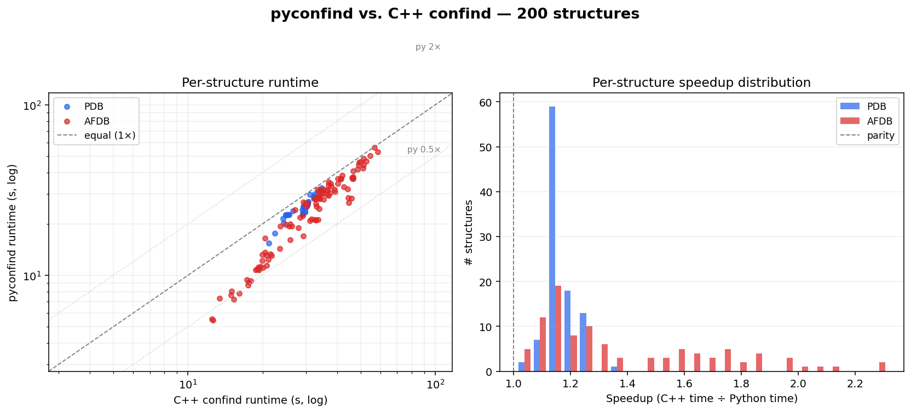

# Real-world stress test: pyconfind vs. C++ confind

Tested pyconfind against the reference C++ binary on several batches of real
structures spanning size, chain count, resolution, and numbering style.

## Results

### Single-chain batch (200 structures)

100 from the RCSB PDB (single-chain X-ray, 50-200 residues) and 100 from the
AlphaFold DB (human reviewed UniProt, 50-300 residue sequences).

|              | Structures | Byte-identical | Speedup |
|--------------|-----------:|---------------:|--------:|
| **PDB**      |        100 |            100 | 1.17× |
| **AFDB**     |        100 |            100 | 1.27× |
| **Combined** |        200 |        **200** | 1.22× |

### Multi-chain / large batch (50 structures)

2-8 protein chains, 200-600 residues, X-ray. **45 / 50 byte-identical.** All
5 mismatches are thrombin-family structures with chymotrypsin insertion-code
numbering — the [insertion-code limitation](#insertion-code-ordering-limitation)
below. No other bug class appeared; the remaining 45 (including assemblies up
to ~700 residues / 8 chains) are byte-for-byte identical.

### High-resolution / alternate-location spot check

1EJG, 3NIR, 1US0 (sub-Ångström structures with hundreds of alternate-location
atoms, and in 1US0's case an incomplete residue): **3 / 3 byte-identical**,
including the partial-residue case the C++ warns about.

Across all batches, every output row — contact, sumcond, percont, crwdnes,
freedom, SEQUENCE — is byte-for-byte identical except for the insertion-code
structures noted below.

> **Note on timings:** the speedup figures in the table above were measured
> *before* the contact-loop vectorization (commit "Vectorize contact
> detection"). Current performance is substantially better — see
> [benchmark.md](benchmark.md) for up-to-date numbers (3-8× per structure
> with the library amortized). The byte-identity result is unaffected.

## A formerly-tricky case (now fixed)

An earlier run had a single `freedom` mismatch at `AF-O15116-F1` position
`A,68` (a GLY residue): 0.001887 vs. the C++'s 0.001334. The cause was a
zero-weight rotamer. MSL's `contactProbability` accumulates
collision-probability mass into `cp[i] += p2` even when the i-side rotamer
weight is zero (and a few EBL rotamer entries have weight exactly 0.0). Our
contact loop was early-returning when `sum(weights_i) * sum(weights_j) == 0`,
skipping that accumulation, so the lone surviving zero-weight rotamer failed
to register in the freedom counter. Removing the early return (while still
returning NaN for the 0/0 contact degree) brought it into agreement.

## Insertion-code ordering limitation

Structures with insertion-code numbering (proteases with chymotrypsin
numbering, antibodies with Kabat/Chothia numbering) can list residues that
share a residue number but differ by insertion code, sometimes out of
ascending order in the file (e.g. thrombin chain L: `1H, 1G, ..., 1A, 1`).

MSL orders chain positions with an insertion sort whose comparator,
`MslTools::sortByResnumIcodeAscending`, contains a bug: it compares an
insertion code against *itself* (`icode1[0] < icode1[1]`) rather than
`icode1` vs `icode2`. For a blank insertion code this reads one byte past the
string's null terminator — **undefined behavior**. Its result is not even
self-consistent within a single run (in `1A3B` the blank code sorts *before*
the lettered ones at residue 1 but *after* them at residue 184).

This is not merely cosmetic: `Position::getPhi`/`getPsi` use the previous/next
position *in chain order*, so the ordering feeds into phi/psi, the rotamer
bin, and ultimately contact values for the affected residues.

pyconfind uses a deterministic rule — residue number ascending, blank
insertion code first, lettered codes in file order — which reproduces MSL for
the common N-terminal-insertion pattern (45/50 multi-chain structures, e.g.
1A2C/1A46/1AHT) but cannot match MSL's run-dependent UB for structures with
internal out-of-order insertion codes (5/50: 1A3B, 1A3E, 1AIX, 1AVG, 1AWF).
For those, pyconfind's ordering is well-defined and arguably more correct; the
contact *values* for residues outside the insertion-coded region are
unaffected.

## Reproduce

```bash
# Build the reference C++ binary once.
scripts/build-reference.sh

# Run the comparison.
python scripts/stress_test.py \
    --rLib original-source/confind-msl/rotlibs \
    --cpp-binary original-source/confind-msl/mslib/bin/confind \
    --pdb-count 100 --afdb-count 100 \
    --summary-json /tmp/summary.json

# Generate the plot.
python scripts/plot_stress_test.py --summary /tmp/summary.json \
    --out docs/stress_test.png
```


